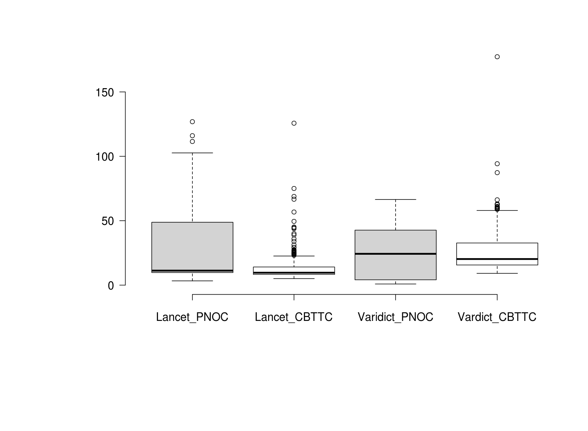
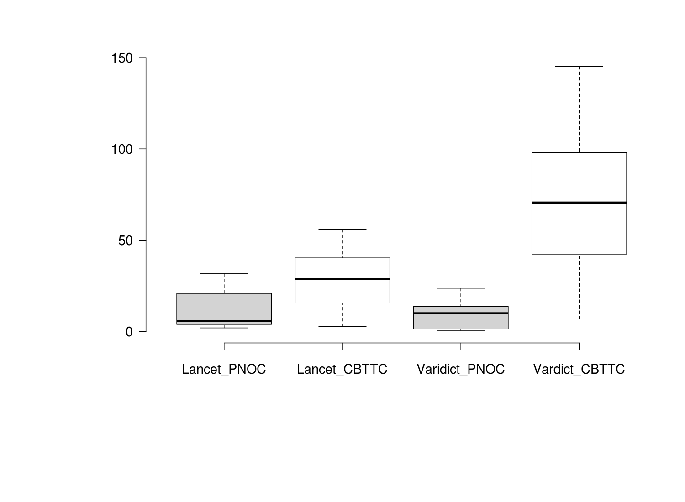

| runtime            | Lancet_PNOC | Lancet_CBTTC | Varidict_PNOC | Vardict_CBTTC |
| ------------------ | ----------- | ------------ | ------------- | ------------- |
| Upper whisker      | 31.64       | 55.92        | 23.68         | 145.18        |
| 3rd quartile       | 20.85       | 40.30        | 13.78         | 97.94         |
| Median             | 5.74        | 28.70        | 9.97          | 70.61         |
| 1st quartile       | 3.90        | 15.67        | 1.41          | 42.37         |
| Lower whisker      | 1.97        | 2.71         | 0.60          | 6.79          |
| Nr. of data points | 109.00      | 897.00       | 75.00         | 897.00        |

| cost               | Lancet_PNOC | Lancet_CBTTC | Varidict_PNOC | Vardict_CBTTC |
| ------------------ | ----------- | ------------ | ------------- | ------------- |
| Upper whisker      | 102.63      | 22.58        | 66.45         | 57.92         |
| 3rd quartile       | 48.78       | 14.07        | 42.67         | 32.69         |
| Median             | 11.25       | 9.63         | 24.29         | 20.25         |
| 1st quartile       | 9.76        | 8.29         | 4.12          | 15.62         |
| Lower whisker      | 3.31        | 5.06         | 0.89          | 9.14          |
| Nr. of data points | 109.00      | 897.00       | 75.00         | 897.00        |

